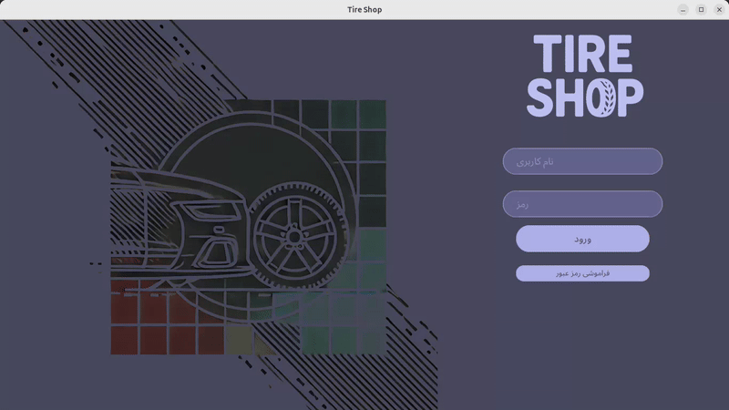
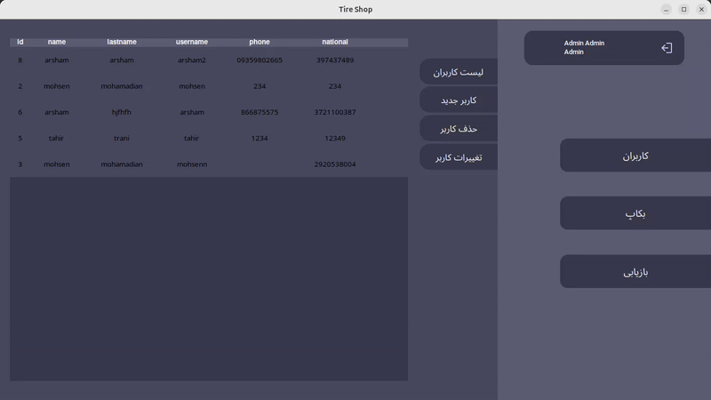
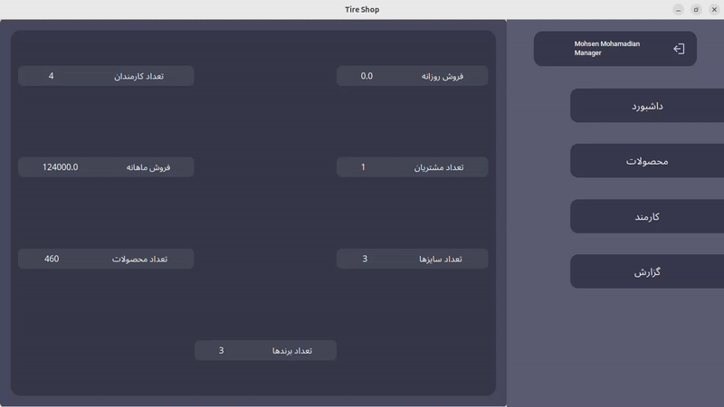
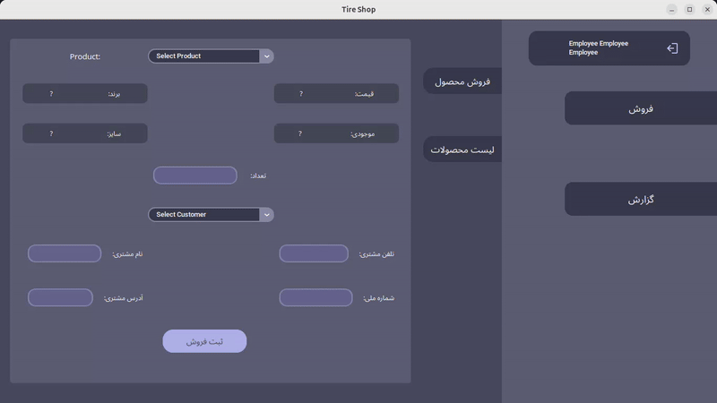

# Tire Shop Management System

A comprehensive tire shop management system developed entirely in Python, demonstrating the power of Python for building professional desktop applications.
## About The Project

This application is designed to streamline tire shop operations with a focus on Persian-language markets. It handles everything from inventory management to sales tracking, featuring:

- Complete tire inventory management with detailed specifications
- Customer relationship management
- Sales and order processing
- Employee management and access control
- Financial reporting and analytics
- Full RTL (Right-to-Left) support for Persian language

The entire system is built using pure Python, utilizing only built-in libraries and minimal external dependencies, making it lightweight and fast.

## Interface Demonstrations

### Login Page


### Admin Dashboard


### Manager Dashboard


### Employee Dashboard


## Features

- Multi-level user access (Admin, Manager, Employee)
- RTL (Right-to-Left) support for Persian language
- Product management (tires) with detailed specifications
- Employee management system
- Sales tracking and reporting
- Database backup and restore capabilities
- Modern and responsive UI

## Installation and Setup

```bash
# Clone the repository
git clone https://github.com/mammadnet/Tire-Shop.git

# Install dependencies
pip install -r requirements.txt

# Run the application
python main.py
```

## Technology Stack

### Core Libraries

- **Tkinter**: Base GUI framework
- **SQLAlchemy**: Database ORM for efficient data management
- **awesometkinter**: RTL support and bidirectional text rendering
- **SQLite**: Local database storage

### Key Features per Library


#### Additional Utilities
- **math**: Mathematical calculations for UI elements
- **os**: File and path operations
- **datetime**: Date and time handling

## Project Structure

```
tireshop/
├── interface/          # UI components and panels
├── database/          # Database models and operations
├── assets/           # Images and resources
└── tests/            # Unit tests
```


